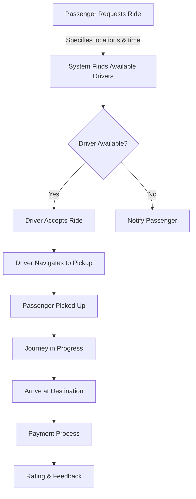

# 🚕 MyTaxi - UTeM Student Ride Service


> **MyTaxi** connects UTeM students with fellow student drivers, creating a safe, convenient, and affordable transportation ecosystem within and around campus. Built by students, for students!

<p align="center">
  
</p>

## ✨ Features

### 👥 For Users
- **🔐 Smart Authentication** - Secure login and registration with role-based access (passenger, driver, admin)
- **🗺️ Interactive Maps** - Real-time location tracking and route planning using Leaflet
- **🔍 Smart Search** - Address autocomplete and intelligent location suggestions
- **📱 Responsive Design** - Seamless experience across mobile, tablet, and desktop devices

### 🧳 For Passengers
- **🚗 Easy Ride Requests** - Book rides with just a few taps
- **📍 Live Tracking** - Follow your ride's progress in real-time
- **📊 Ride History** - Access detailed history of all your past trips
- **⭐ Driver Ratings** - Rate drivers and provide feedback after rides

### 🚘 For Drivers
- **📅 Flexible Availability** - Set your driving schedule on your terms
- **💰 Earnings Tracker** - Monitor your earnings with detailed breakdowns
- **🧭 Navigation** - Integrated turn-by-turn directions to pickup and drop-off locations
- **📈 Performance Metrics** - View your ratings and performance statistics

### 👨‍💼 For Administrators
- **📊 Comprehensive Dashboard** - Monitor all platform activities from one place
- **👤 User Management** - Manage passenger and driver accounts
- **📝 System Settings** - Configure platform parameters and policies
- **📊 Analytics** - Access detailed reports and actionable insights

## 🛠️ Tech Stack

<p align="center">
  
  
  
  
  
  
</p>

- **🖥️ Frontend**: HTML5, CSS3, Bootstrap 5, JavaScript
- **⚙️ Backend**: Node.js, Express.js (v5.1.0)
- **🔄 View Engine**: EJS templates with express-ejs-layouts
- **🗺️ Maps & Location**: 
  - Leaflet.js - Lightweight, mobile-friendly interactive maps
  - Leaflet Routing Machine - Turn-by-turn directions
  - Leaflet Locate Control - User location detection
- **🔍 Form Enhancement**: AutoComplete.js for intelligent address search
- **🔒 Authentication**: Session-based authentication with express-session
- **💾 Database**: MongoDB integration planned for future development
- **🔧 Development Tools**: Nodemon for auto-reloading during development

## 📋 Prerequisites

- Node.js v16 or higher
- npm v8 or higher
- Modern web browser (Chrome, Firefox, Safari, Edge)

## 🚀 Installation

1. **Clone the repository**
   ```bash
   git clone https://github.com/yourusername/mytaxi.git
   cd mytaxi
   ```

2. **Install dependencies**
   ```bash
   npm install
   ```

3. **Start the development server**
   ```bash
   npm run dev
   ```

4. **Access the application**
   ```
   http://localhost:3000
   ```

## 📂 Project Structure

```
mytaxi/
├── 📄 index.js                # Main application entry point
├── 📁 src/
│   ├── 📁 routes/             # Route handlers for different user roles
│   │   ├── 📄 index.js        # Main routes (home, about, contact, faq)
│   │   ├── 📄 auth.js         # Authentication routes (login, register)
│   │   ├── 📄 passenger.js    # Passenger-specific routes
│   │   ├── 📄 driver.js       # Driver-specific routes
│   │   └── 📄 admin.js        # Admin-specific routes
│   ├── 📁 views/              # EJS templates
│   │   ├── 📄 layout.ejs      # Main layout template
│   │   ├── 📁 partials/       # Reusable template parts (header, footer)
│   │   ├── 📁 auth/           # Authentication pages
│   │   ├── 📁 passenger/      # Passenger-specific pages
│   │   ├── 📁 driver/         # Driver-specific pages
│   │   └── 📁 admin/          # Admin-specific pages
│   └── 📁 public/             # Static assets
│       ├── 📁 css/            # Stylesheets
│       ├── 📁 js/             # Client-side JavaScript
│       │   ├── 📄 script.js   # Main JavaScript file
│       │   ├── 📁 autocomplete/# Address autocomplete functionality
│       │   ├── 📁 leaflet/    # Map library
│       │   └── 📁 leaflet-routing-machine/ # Route planning
│       └── 📁 images/         # Images and icons
├── 📄 package.json            # Project dependencies and scripts
└── 📄 README.md               # Project documentation
```

## 🧩 Key Components

### 🔐 Authentication System
Our authentication system uses express-session to manage user sessions securely. Users can register as either passengers or drivers, with separate workflows and verification processes for each role.

### 🗺️ Interactive Maps
The mapping system is built on Leaflet.js, providing:
- Real-time location tracking
- Custom markers for pickups, drop-offs, and drivers
- Turn-by-turn navigation for drivers
- Geolocation services for accurate positioning

### 📱 Responsive UI
The application is built with a mobile-first approach using Bootstrap 5:
- Adapts seamlessly to all screen sizes
- Touch-friendly interface for mobile users
- Optimized layout for different devices
- Fast loading times with optimized assets

### 🔄 Ride Flow



## 👨‍💻 Usage Guide

### 🧳 For Passengers

1. **Register as a passenger**
   - Sign up with your UTeM email
   - Verify your student ID
   - Complete your profile with a photo

2. **Request a ride**
   - Enter pickup and drop-off locations
   - Choose your preferred time
   - Add any special instructions for the driver

3. **During the ride**
   - Track your driver's location in real-time
   - Communicate with the driver through the in-app chat
   - Share your trip status with friends for safety

4. **After the ride**
   - Rate your driver and provide feedback
   - View ride details in your history
   - Save frequently used routes for quick booking

### 🚘 For Drivers

1. **Register as a driver**
   - Sign up with your UTeM email
   - Submit your driver's license and vehicle information
   - Complete the verification process

2. **Manage your availability**
   - Set your working hours
   - Define your service areas
   - Update your status (online/offline)

3. **Handle ride requests**
   - Receive notifications for nearby ride requests
   - Accept or decline based on your preference
   - Use the in-app navigation to pickup and drop-off points

4. **Track your performance**
   - Monitor your earnings and completed rides
   - View your ratings and passenger feedback
   - Analyze your busiest times and most profitable routes

### 👨‍💼 For Administrators

1. **Access the admin dashboard**
   - Log in with admin credentials
   - View system overview and key metrics

2. **Manage users**
   - Review and approve driver applications
   - Handle user reports and issues
   - Monitor user activity and engagement

3. **System configuration**
   - Adjust pricing algorithms
   - Configure service areas and restrictions
   - Manage notification settings

## 🌟 Key Features Implementation

- **🗺️ Interactive Maps**: Custom implementation using Leaflet.js with personalized markers and routing overlays
- **📍 Real-time Location**: Leverages Leaflet Locate Control with custom accuracy circles and auto-follow functionality
- **🔍 Address Search**: Intelligent address prediction with AutoComplete.js, featuring UTeM-specific locations
- **📱 Responsive UI**: Bootstrap 5 components with custom CSS for a unique, branded experience
- **🔒 Session Management**: Secure, encrypted user sessions with timeout protection and device tracking
- **⚠️ Error Handling**: User-friendly error messages with detailed logging for administrators

## 🔮 Future Enhancements

- **💾 Database Integration**: MongoDB implementation for scalable data storage
- **🔔 Real-time Notifications**: WebSocket integration for instant updates
- **💳 Payment Gateway**: Secure payment processing for cashless transactions
- **📱 Mobile App**: Native mobile applications using React Native
- **📊 Advanced Analytics**: Machine learning for ride demand prediction
- **✅ Driver Verification**: Enhanced verification process with background checks
- **🔄 Recurring Rides**: Schedule regular rides for consistent commutes
- **👥 Ride Sharing**: Allow multiple passengers to share rides and split costs

## 🤝 Contributing

We welcome contributions from the UTeM community! Here's how you can help:

1. **Fork the repository**
2. **Create your feature branch**
   ```bash
   git checkout -b feature/amazing-feature
   ```
3. **Commit your changes**
   ```bash
   git commit -m 'Add some amazing feature'
   ```
4. **Push to the branch**
   ```bash
   git push origin feature/amazing-feature
   ```
5. **Open a Pull Request**

Please make sure to update tests as appropriate and adhere to our coding standards.

## 📜 License

This project is licensed under the ISC License - see the LICENSE file for details.

## 📞 Contact

For questions or support, please email support@mytaxi.utem.edu.my

---

<p align="center">
  Made by UTeM Students for UTeM Students
</p> 